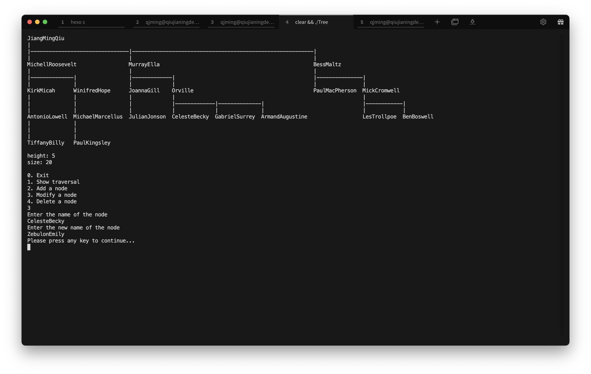
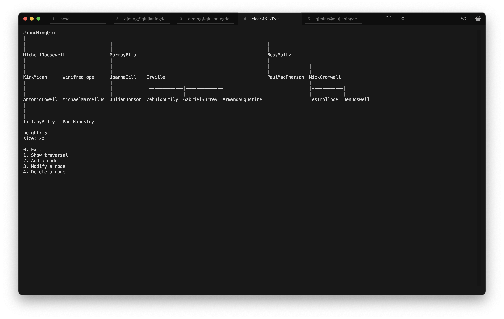
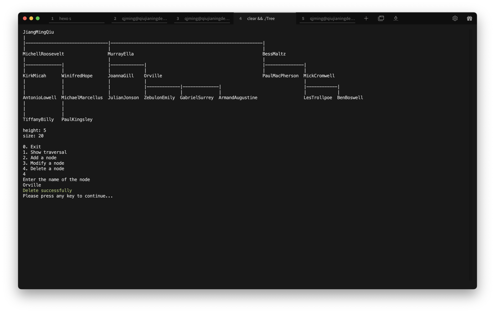
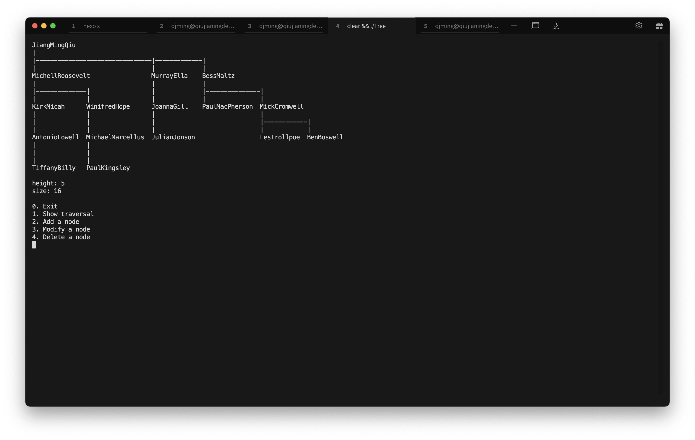
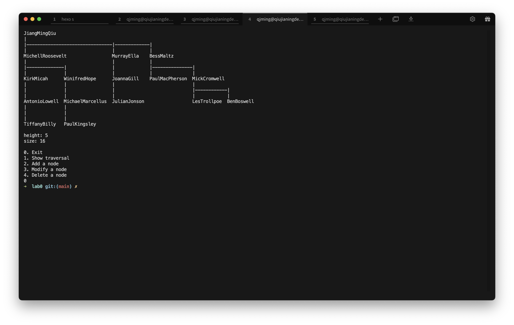
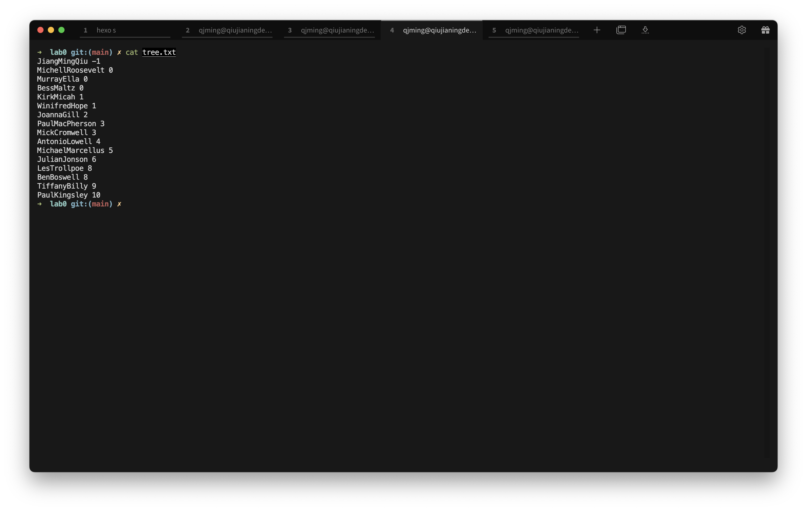
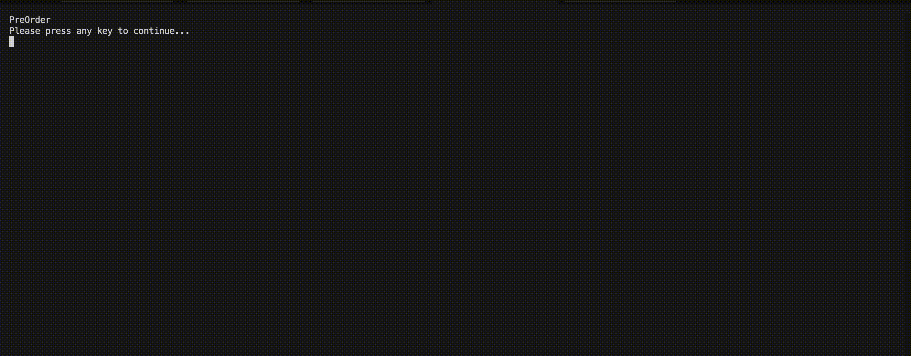
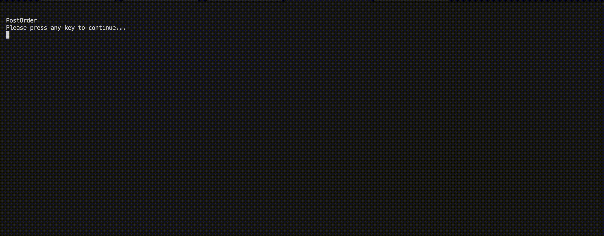

## 总体描述

本程序

## 程序运行展示

### 程序主界面 

> 上方显示当前树，树下面显示树的高度和结点树，最下方是菜单


### 新增结点

> 输入需要新增的结点名和父结点


> 新增结点后的图示


### 修改结点

> 输入需要修改的结点名和新的结点名



> 修改结点后的图示



### 删除结点

> 输入要删除的结点名



> 删除后的效果



### 保存功能

> 退出菜单后自动保存



> 保存后的文件内容



### 读取功能

> 运行程序时自动读取


### 遍历顺序

> 先序遍历



> 后序遍历



> 层序遍历


## 功能设计思路

### 树的存储方式

```c++
class Tree {
private:
    std::string _name;
    Tree *_firstChild;
    Tree *_nextSibling;
};
```

采用孩子一兄弟表示法，数据域存储该结点的姓名

### 文件存储格式

```
JiangMingQiu -1
MichellRoosevelt 0
MurrayElla 0
BessMaltz 0
KirkMicah 1
...
```

每行两个数据，第一个是结点的名字，第二个是结点的父结点的下标

### 获取树的高度和结点数

高度：使用dfs递归获取

结点数：遍历树后获得

### 新增结点

将新结点添加到当前树的子结点，通过find函数获取新增结点的父结点所在的子树

### 修改结点

通过setName函数改变当前结点的内容，同样需要通过find函数获取新增结点的父结点所在的子树

### 删除结点

通过dfs递归查找结点并删除，同时删除该节点为根结点的子树

### 保存文件

先按层序遍历获取所有结点，然后通过遍历的方式获取每个结点的父结点索引

输出格式为结点名+父结点索引的方式，根结点的索引为-1

### 读取文件

逐行读取结点名和父结点索引并按顺序插入即可

由于文件是按层序遍历的顺序存储的，所以在文件格式合法的情况下父结点的索引必在已经读取的序列中

### 树的显示

首先创建一个字符串数组存储输出的图像

接着计算每行每个结点所在位置的起始索引

最后填充连接结点的横线即可

```c++
/**
  * dfs计算每个节点的位置
  *
  * @param node 当前节点
  * @param index 当前节点的位置
  * @return 这颗树的宽度
  */
  std::function<int(Tree *, int)> calculate_index = [&](Tree *node, int index) {...}
```

计算索引的方式为：使用dfs递归计算，对于每个结点所代表的子树，树的宽度为该结点的兄弟结点宽度之和与该结点名的长度中的较大值，即

```c++
// 2是为了保证节点之间至少有一个空格
std::max(calculate_index(sibling, index + length), static_cast<int>(sibling->getName().length() + 2));
```

### 动画显示

在树的显示基础上高亮某个结点，在输出图像的过程中对于含有高亮结点的那一行进行特殊处理，以达到高亮该结点的目的，每次显示完后等待0.5秒清空控制台再显示下一个图像即达到显示动画的效果。

## 心得体会

