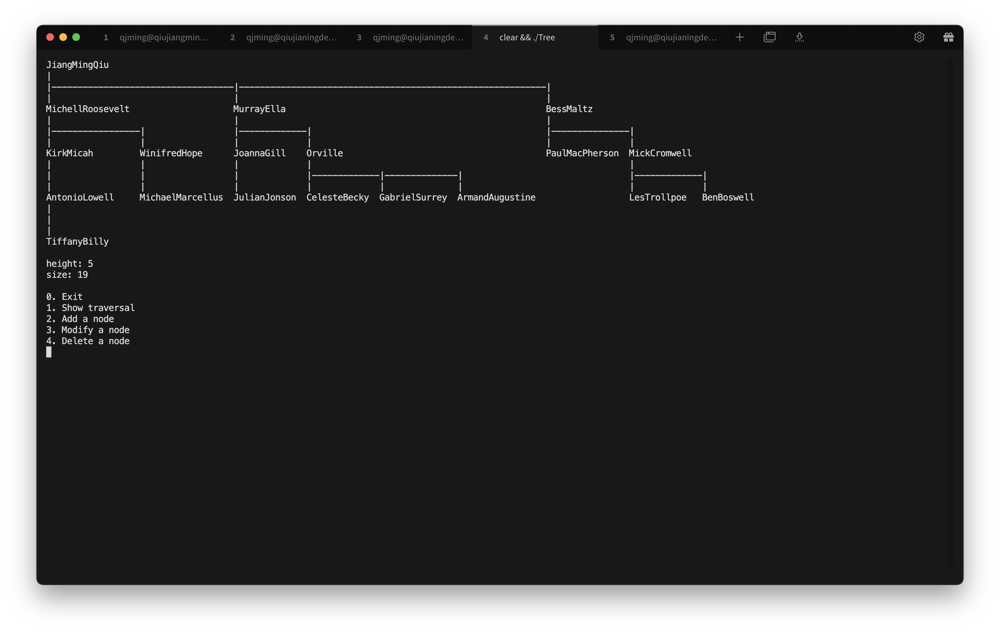
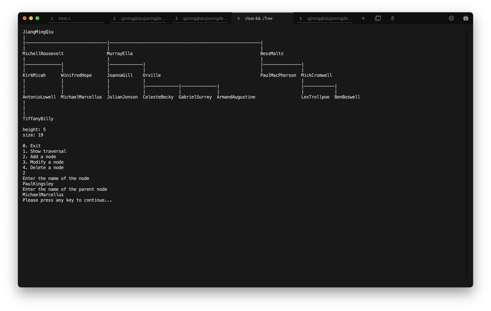
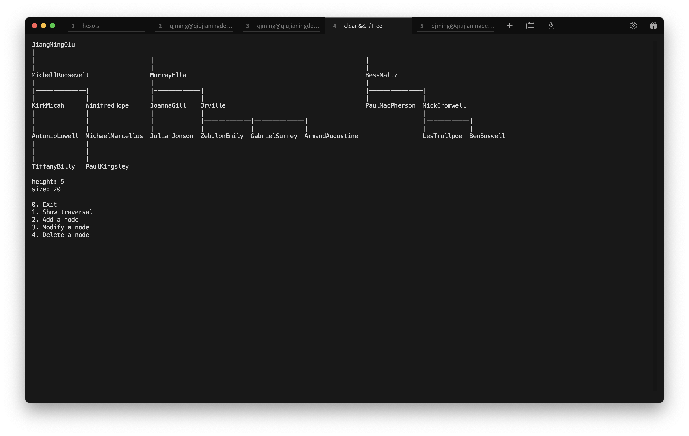
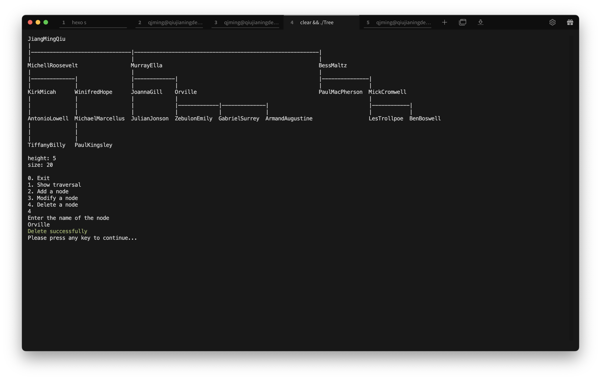
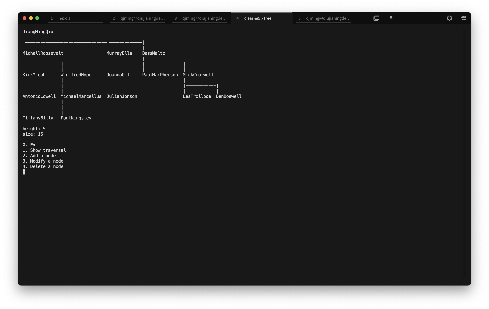
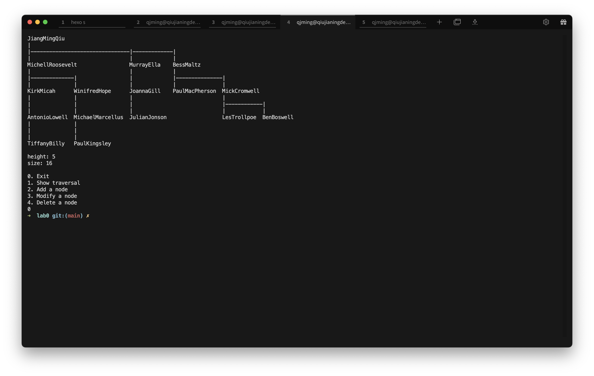
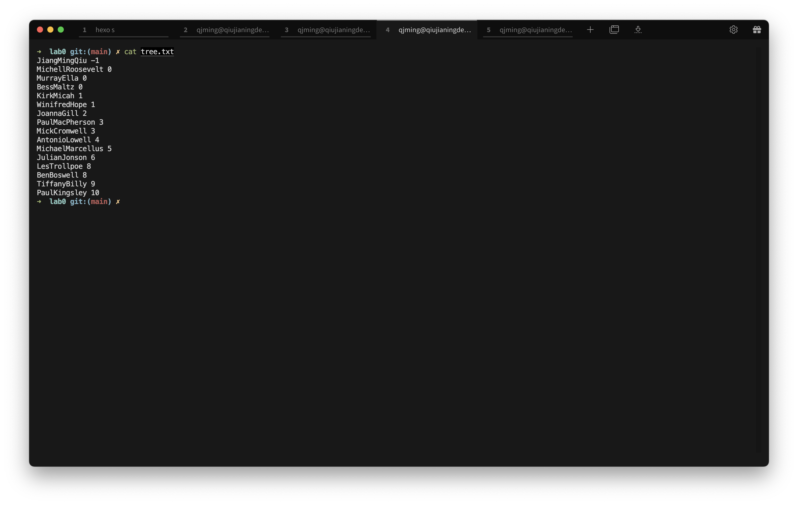
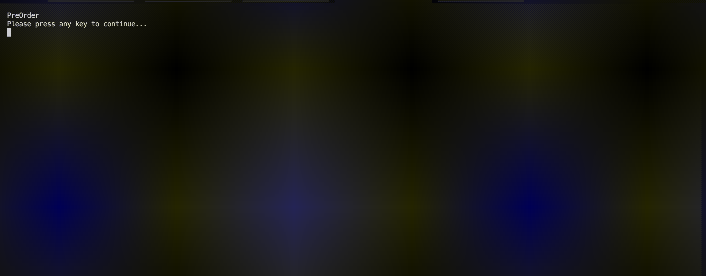
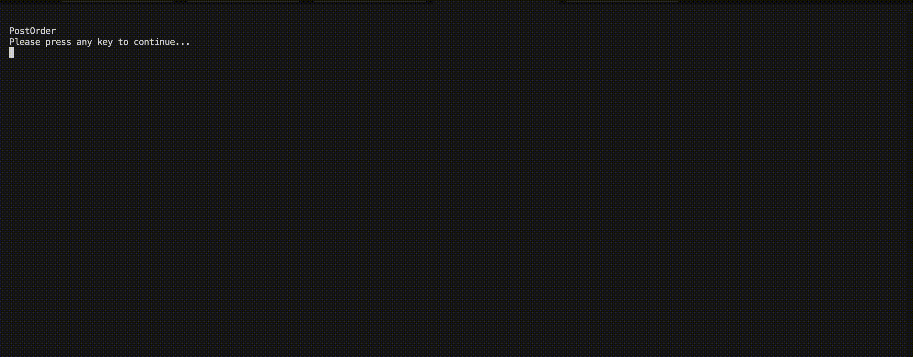

# 实验一

## 实验题目

家谱管理系统设计

## 实验内容

### 总体描述

本程序使用孩子一兄弟表示法表示了一颗普通的树，实现了对其增加、修改和删除结点的操作，通过命令行打印的形式显示整颗树，同时实现了对树到文件的存储和读取，并对于二叉树的三种遍历：前序、后序和中序进行了动画演示。

## 程序运行展示

### 程序主界面 

> 上方显示当前树，树下面显示树的高度和结点树，最下方是菜单



### 新增结点

> 输入需要新增的结点名和父结点



> 新增结点后的图示


### 修改结点

> 输入需要修改的结点名和新的结点名


> 修改结点后的图示



### 删除结点

> 输入要删除的结点名



> 删除后的效果



### 保存功能

> 退出菜单后自动保存



> 保存后的文件内容



### 读取功能

> 运行程序时自动读取


### 遍历顺序（动画演示）

> 先序遍历



> 后序遍历



> 层序遍历


## 功能设计思路

### 树的存储方式

```c++
class Tree {
private:
    std::string _name;
    Tree *_firstChild;
    Tree *_nextSibling;
};
```

采用孩子一兄弟表示法，数据域存储该结点的姓名

### 文件存储格式

```
JiangMingQiu -1
MichellRoosevelt 0
MurrayElla 0
BessMaltz 0
KirkMicah 1
...
```

每行两个数据，第一个是结点的名字，第二个是结点的父结点的下标

### 获取树的高度和结点数

高度：使用dfs递归获取

结点数：遍历树后获得

### 新增结点

将新结点添加到当前树的子结点，通过find函数获取新增结点的父结点所在的子树

### 修改结点

通过setName函数改变当前结点的内容，同样需要通过find函数获取新增结点的父结点所在的子树

### 删除结点

通过dfs递归查找结点并删除，同时删除该节点为根结点的子树

### 保存文件

先按层序遍历获取所有结点，然后通过遍历的方式获取每个结点的父结点索引
输出格式为结点名+父结点索引的方式，根结点的索引为-1

### 读取文件

逐行读取结点名和父结点索引并按顺序插入即可
由于文件是按层序遍历的顺序存储的，所以在文件格式合法的情况下父结点的索引必在已经读取的序列中

### 树的显示

首先创建一个字符串数组存储输出的图像
接着计算每行每个结点所在位置的起始索引
最后填充连接结点的横线即可

```c++
/**
  * dfs计算每个节点的位置
  *
  * @param node 当前节点
  * @param index 当前节点的位置
  * @return 这颗树的宽度
  */
  std::function<int(Tree *, int)> calculate_index = [&](Tree *node, int index) {...}
```

计算索引的方式为：使用dfs递归计算，对于每个结点所代表的子树，树的宽度为该结点的兄弟结点宽度之和与该结点名的长度中的较大值，即

```c++
// 2是为了保证节点之间至少有一个空格
std::max(calculate_index(sibling, index + length), static_cast<int>(sibling->getName().length() + 2));
```

### 动画显示

在树的显示基础上高亮某个结点，在输出图像的过程中对于含有高亮结点的那一行进行特殊处理，以达到高亮该结点的目的，每次显示完后等待0.5秒清空控制台再显示下一个图像即达到显示动画的效果。

## 心得体会

​	在设计家谱管理系统的过程中，我深刻体会到了软件设计的乐趣和挑战。通过这个项目，我学到了许多关于数据结构和算法的知识，并且锻炼了自己的编程能力和设计能力。
​	在设计过程中，我学会了如何选择合适的数据结构来表示树形结构。孩子一兄弟表示法是一种简洁而有效的方法，能够很好地支持树的各种操作。通过这种表示法，我可以轻松地实现新增、修改和删除结点等功能。
​	此外，我还学会了如何利用动画效果来增强用户体验。通过动画演示树的遍历过程，我可以直观地展示算法的执行过程，帮助用户更好地理解树的遍历算法。这种直观的展示方式可以提高用户的学习效率和兴趣。
​	综上所述，通过设计家谱管理系统，我不仅学到了许多关于数据结构和算法的知识，还锻炼了自己的编程能力和设计能力，同时也体会到了团队合作的重要性。这是一次非常有意义的学习和成长之旅，我会继续努力学习，不断提升自己的技能水平。
