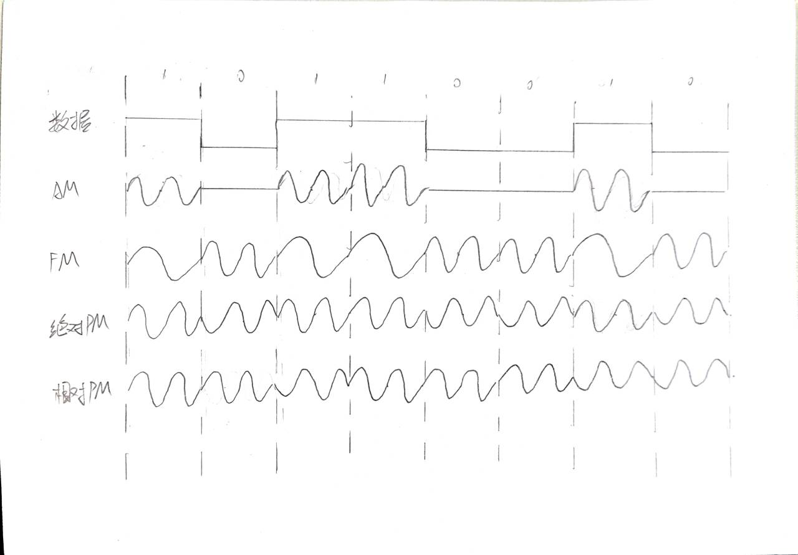
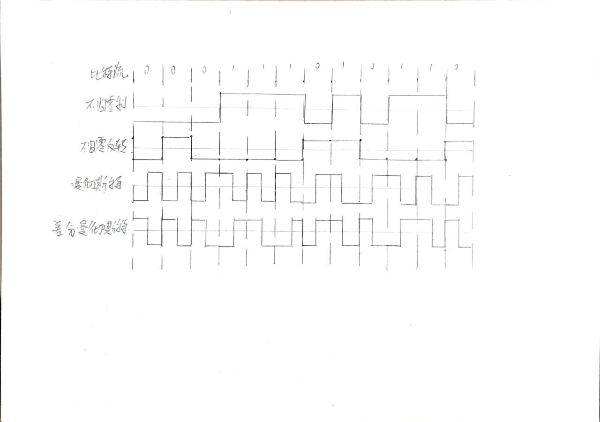

# 作业一: 物理层课后作业

### 1. 写出下列缩略语的英文全称和中文含义

- IMP: Interface Message Processor 接口信息处理器
- OSI/RM: Open Systems Interconnection Reference Model 开放系统互连参考模型
- MODEM: Modulator-Demodulator 调制解调器
- LAN: Local Area Network 局域网
- FDM: Frequency Division Multiplexing 频分复用
- TDM: Time Division Multiplexing 时分复用
- STDM: Synchronous Time Division Multiplexing 同步时分复用
- WDM: Wavelength Division Multiplexing 波分复用
- DWDM: Dense Wavelength Division Multiplexing 密集波分复用
- CDMA: Code Division Multiple Access 码分多址
- PCM: Pulse Code Modulation 脉冲编码调制
- SONET: Synchronous Optical Network 同步光网络
- SDH: Synchronous Digital Hierarchy 同步数字体系
- STM-1: Synchronous Transport Module level-1 同步传输模块1级
- OC-48: Optical Carrier level-48 光载波48级
- DTE: Data Terminal Equipment 数据终端设备
- DCE: Data Circuit-terminating Equipment / Data Communication Equipment 数据电路终端设备 / 数据通信设备
- QAM: Quadrature Amplitude Modulation 正交振幅调制

### 2. 什么叫码元速率？什么叫信息速率？两者的关系如何？

码元速率：码元传输速率，又叫波特率，单位：码元/秒
信息速率：数据传输速率，又叫比特率，单位：比特/秒

码元速率 = 信息速率 * 每个码元所携带的比特数

### 3. 电视信道的带宽为6MHZ，如果全使用4个电平的数字信号，每秒种能发送多少比特？

电视信道的带宽为 $$ 6MHZ $$，即 $$ 6*10^6HZ $$
全使用4个电平的数字信号，即每个码元携带2个比特
$$ 每秒种能发送的比特数 = 6*10^6HZ * 2 = 1.2*10^7 \ bps $$

### 4. 一个二进制信号经过信噪比为30dB的3kHz信道传送，问最大可达到的数据传输率是多少？ 

$$
\begin{align}

C &= W \times log_2(1+\frac{S}{N}) \\
  &= 3 \times 10^3 \times log_2(1+10^{30/10}) \\
  &= 2.99\times 10^4 \  (bit/s)

\end{align}
$$

### 5. 若要在一条50KHZ的信道上传输1.544Mbps的T1载波，信噪比至少要多大? 

$$
\begin{align}

\frac{S}{N} &= 2^{\frac{C}{W}} - 1 \\
           &= 2^{\frac{1.544 \times 10^6}{50 \times 10^3}} - 1 \\
           &= 1.976 \times 10^9 \\
           &= 92.958 \  (dB)

\end{align}
$$

### 6. 画出传输10110010时，采用AM、FM、绝对PM、相对PM不同的调制方式时的信号波形图(二元制)。 

### 7. 试画出比特流000111010110的不归零编码（NRZ）、不归零码反转（NRZI）、曼彻斯特编码、差分曼彻斯特编码的波形？

### 8. 收发两端之间的传输距离为1000km，信号在媒体上的传播速率为2.0*10^8m/s。试计算以下两种情况的发送时延和传播时延： 

1. 数据长度为10^7 bit，数据发送速率为100kb/s；

$$
\begin{align}

发送时延&=\frac{10^7}{10^5} \\
      &=100 \ (s) \\

传播时延&=\frac{1000*10^3}{2*10^8} \\
      &=5\times 10^{-3} \ (s)

\end{align}
$$

2. 数据长度为10^3 bit，数据发送速率为1Gb/s

$$
\begin{align}

发送时延&=\frac{10^3}{10^9} \\
      &=10^{-6} \ (s) \\

传播时延&=\frac{1000*10^3}{2*10^8} \\
      &=5\times 10^{-3} \ (s)

\end{align}
$$

**从以上计算结果可得出什么结论？**

发送时延与数据长度成正比，与数据发送速率成反比。
传播时延只跟传输距离和传播速率有关，与数据长度和数据发送速率无关。

### 9. 共有4个站进行码分多址CDMA通信。问哪个站发送了数据？发送数据的站发送的是 1 还是 0？ 

$$
A：(-1 -1 -1 +1 +1 -1 +1 +1) \\
B：(-1 -1 +1 -1 +1 +1 +1 -1) \\
C：(-1 +1 -1 +1 +1 +1 -1 -1) \\
D：(-1 +1 -1 -1 -1 -1 +1 -1) \\

X：(-1 +1 -3 +1 -1 -3 +1 +1) \\
$$

$$
\begin{align}

A \cdot X &= \frac{1}{8} \times (1-1+3+1-1+3+1+1) = \frac{1}{8} \times 8 = 1 \\
B \cdot X &= \frac{1}{8} \times (1-1-3-1-1-3+1-1) = \frac{1}{8} \times (-8) = -1 \\
C \cdot X &= \frac{1}{8} \times (1+1+3+1-1-3-1-1) = \frac{1}{8} \times 0 = 0 \\
D \cdot X &= \frac{1}{8} \times (1+1+3-1+1+3+1-1) = \frac{1}{8} \times 8 = 1 \\

\end{align}
$$

站A发送了数据，发送的是1。
站B发送了数据，发送的是0。
站C没有发送数据。
站D发送了数据，发送的是1。

### 10. 长度为100字节的应用层数据交给运输层传送，需加上20字节的TCP首部。再交给网络层传送，需加上20字节的IP首部。最后交给数据链路层的以太网传送，加上首部和尾部共18字节。试求数据的传输效率。
> 数据的传输效率是指发送的应用层数据除以所发送的总数据（即应用数据加上各种首部和尾部的额外开销）。

$$
传输效率=\frac{100}{100+20+20+18} \times 100\% = 64.29\%
$$

**若应用层数据长度为1000字节，数据的传输效率是多少？**

$$
传输效率=\frac{1000}{1000+20+20+18} \times 100\% = 94.52\%
$$

### 11. 假定某信道受奈氏准则限制的最高码元速率为20000码元/秒。如果采用振幅调制，把码元的振幅划分为16个不同等级来传送，那么可以获得多高的数据率 (bit/s)？

$$
最高数据率=20000 \times log_2(16) = 80000 \ (bit/s)
$$
