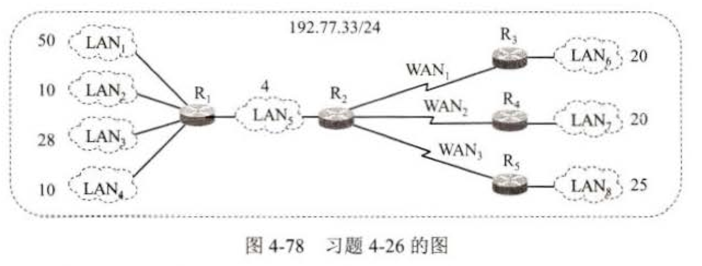

# 作业三: 网络层层课后作业

### 1. 写出下列缩略语的英文全称和中文含义

- CIDR: Classless Inter-Domain Routing 无类域间路由
- IP: Internet Protocol 互联网协议
- ICMP: Internet Control Message Protocol 互联网控制报文协议
- IGMP: Internet Group Management Protocol 互联网组管理协议
- ARP: Address Resolution Protocol 地址解析协议
- RARP: Reverse Address Resolution Protocol 反向地址解析协议
- RIP: Routing Information Protocol 路由信息协议
- OSPF: Open Shortest Path First 开放最短路径优先
- IGP: Interior Gateway Protocol 内部网关协议
- BGP: Border Gateway Protocol 边界网关协议
- NAT: Network Address Translation 网络地址转换
- TTL: Time To Live 存活时间

### 2. 找出不能分配给主机的 IP 地址，并说明原因：

A: 131.107.256.80
B: 231.222.0.11
C: 126.0.0.0
D: 198.121.254.255
E: 202.117.34.32

- A: 不能分配给主机，因为第三个字段超出了 0-255 的范围。
- B: 不能分配给主机，这个地址属于D类，是一个多播地址。
- C: 不能分配给主机，这个地址主机部分全为 0，是网络地址。
- D: 不能分配给主机，这个地址主机部分全为 1，是广播地址。
- E: 可以分配给主机。

### 3. 网络 193.1.1.0，子网掩码是 255.255.255.224。问：这个子网掩码可划分几个子网，每个子网的子网地址和主机 IP 地址范围是什么？

子网掩码 255.255.255.224 可以表示为二进制：11111111.11111111.11111111.11100000，有 5 位 用于主机部分。
所以有 3 位用于子网部分，可以划分 `$2^3 = 8$` 个子网。

每个子网的子网地址范围是 32 个 IP 地址，主机 IP 地址范围是 30 个 IP 地址。

| 子网        | 主机 IP 地址范围          |
| ----------- | ------------------------- |
| 193.1.1.0   | 193.1.1.1 - 193.1.1.30    |
| 193.1.1.32  | 193.1.1.33 - 193.1.1.62   |
| 193.1.1.64  | 193.1.1.65 - 193.1.1.94   |
| 193.1.1.96  | 193.1.1.97 - 193.1.1.126  |
| 193.1.1.128 | 193.1.1.129 - 193.1.1.158 |
| 193.1.1.160 | 193.1.1.161 - 193.1.1.190 |
| 193.1.1.192 | 193.1.1.193 - 193.1.1.222 |
| 193.1.1.224 | 193.1.1.225 - 193.1.1.254 |

### 4.设备路由器建立了如下转发表:

| 前缀匹配         | 下一跳  |
| ---------------- | ------- |
| 192.4.153.0/26   | R₃      |
| 128.96.39.0/25   | 接口 m₀ |
| 128.96.39.128/25 | 接口 m₁ |
| 128.96.40.0/25   | R₂      |
| 192.4.153.0/26   | R₃      |
| *（默认）        | R₄      |

现共收到 5 个分组, 其目的地址分别为:  
(1) 128.96.39.10  
(2) 128.96.40.12  
(3) 128.96.40.151  
(4) 192.4.153.17  
(5) 192.4.153.90  

试分别计算其下一跳。

| 目的地址      | 最长前缀匹配   | 下一跳  |
| ------------- | -------------- | ------- |
| 128.96.39.10  | 128.96.39.0/25 | 接口 m₀ |
| 128.96.40.12  | 128.96.40.0/25 | R₂      |
| 128.96.40.151 | 128.96.40.0/25 | R₂      |
| 192.4.153.17  | 192.4.153.0/26 | R₃      |
| 192.4.153.90  | 默认           | R₄      |

### 5. 某单位分配到一个地址块 129.250/16。该单位有 4000 台机器，平均分布在 16 个不同的地点，试给每个地点分配一个地址块，并算出每个地址块中 IP 地址的最小值和最大值。

| 地点 | 地址块           | 起始 IP 地址  | 结束 IP 地址    |
| ---- | ---------------- | ------------- | --------------- |
| 1    | 129.250.0.0/20   | 129.250.0.0   | 129.250.15.255  |
| 2    | 129.250.16.0/20  | 129.250.16.0  | 129.250.31.255  |
| 3    | 129.250.32.0/20  | 129.250.32.0  | 129.250.47.255  |
| 4    | 129.250.48.0/20  | 129.250.48.0  | 129.250.63.255  |
| 5    | 129.250.64.0/20  | 129.250.64.0  | 129.250.79.255  |
| 6    | 129.250.80.0/20  | 129.250.80.0  | 129.250.95.255  |
| 7    | 129.250.96.0/20  | 129.250.96.0  | 129.250.111.255 |
| 8    | 129.250.112.0/20 | 129.250.112.0 | 129.250.127.255 |
| 9    | 129.250.128.0/20 | 129.250.128.0 | 129.250.143.255 |
| 10   | 129.250.144.0/20 | 129.250.144.0 | 129.250.159.255 |
| 11   | 129.250.160.0/20 | 129.250.160.0 | 129.250.175.255 |
| 12   | 129.250.176.0/20 | 129.250.176.0 | 129.250.191.255 |
| 13   | 129.250.192.0/20 | 129.250.192.0 | 129.250.207.255 |
| 14   | 129.250.208.0/20 | 129.250.208.0 | 129.250.223.255 |
| 15   | 129.250.224.0/20 | 129.250.224.0 | 129.250.239.255 |
| 16   | 129.250.240.0/20 | 129.250.240.0 | 129.250.255.255 |

### 6. 一个数据报长度为 4000 字节（固定首部长度）。现在经过一个网络传送，但此网络能传送的最大数据长度为 1500 字节。试问应当划分为几个短些的数据报片？各数据报片的分段字段长度，片偏移字段和 MF 标志应为何值？

| 片次 | 数据长度 (字节) | 总长度 (字节) | 片偏移 (8 字节单位) | MF 标志 |
| ---- | --------------- | ------------- | ------------------- | ------- |
| 1    | 1480            | 1500          | 0                   | 1       |
| 2    | 1480            | 1500          | 185                 | 1       |
| 3    | 1020            | 1040          | 370                 | 0       |

### 7. 一个大公司有一个总部和三个下属部门。公司分配到的网络前缀是 192.77.33/24。公司的网络布局如图 4-78 所示。总部共有 5 个局域网，其中的 LAN₁ ~ LAN₄ 都连接到路由器 R₁ 上，R₁ 再通过 LAN₅ 与路由器 R₂ 相连。R₂ 和远地的三个部门的局域网 LAN₆ ~ LAN₈ 通过广域网相连。每个局域网旁边标明的数字是局域网上的主机数。试给每一个局域网分配一个合适的网络前缀。

| 局域网 | 主机数 | 所需最小 IP 地址数 | 所需网络掩码     |
| ------ | ------ | ------------------ | ---------------- |
| LAN₁   | 50     | 52                 | /26（64 个地址） |
| LAN₂   | 10     | 12                 | /28（16 个地址） |
| LAN₃   | 28     | 30                 | /27（32 个地址） |
| LAN₄   | 10     | 12                 | /28（16 个地址） |
| LAN₅   | 4      | 6                  | /29（8 个地址）  |
| LAN₆   | 20     | 22                 | /27（32 个地址） |
| LAN₇   | 20     | 22                 | /27（32 个地址） |
| LAN₈   | 25     | 27                 | /27（32 个地址） |

| 局域网 | 主机数 | 分配的子网       | IP 地址范围                   |
| ------ | ------ | ---------------- | ----------------------------- |
| LAN₁   | 50     | 192.77.33.0/26   | 192.77.33.0 ~ 192.77.33.63    |
| LAN₂   | 10     | 192.77.33.64/28  | 192.77.33.64 ~ 192.77.33.79   |
| LAN₃   | 28     | 192.77.33.80/27  | 192.77.33.80 ~ 192.77.33.111  |
| LAN₄   | 10     | 192.77.33.112/28 | 192.77.33.112 ~ 192.77.33.127 |
| LAN₅   | 4      | 192.77.33.128/29 | 192.77.33.128 ~ 192.77.33.135 |
| LAN₆   | 20     | 192.77.33.136/27 | 192.77.33.136 ~ 192.77.33.167 |
| LAN₇   | 20     | 192.77.33.168/27 | 192.77.33.168 ~ 192.77.33.199 |
| LAN₈   | 25     | 192.77.33.200/27 | 192.77.33.200 ~ 192.77.33.231 |

### 8. 某单位分配到一个地址块 136.23.12.64/26。现在需要进一步划分为 4 个一样大的子网。试问:  
(1) 每个子网的网络前缀有多长？  
(2) 每一个子网中有多少个地址？  
(3) 每一个子网的地址块是什么？  
(4) 每一个子网可分配给主机使用的最小地址和最大地址是什么？

1. 每个子网的网络前缀：`/28`
2. 每个子网有 16 个 IP 地址
3. 每个子网的地址块：
   - 子网 1：`136.23.12.64/28`，范围：`136.23.12.64 ~ 136.23.12.79`
   - 子网 2：`136.23.12.80/28`，范围：`136.23.12.80 ~ 136.23.12.95`
   - 子网 3：`136.23.12.96/28`，范围：`136.23.12.96 ~ 136.23.12.111`
   - 子网 4：`136.23.12.112/28`，范围：`136.23.12.112 ~ 136.23.12.127`
4. 每个子网可分配给主机使用的最小和最大地址：
   - 子网 1：`136.23.12.65 ~ 136.23.12.78`
   - 子网 2：`136.23.12.81 ~ 136.23.12.94`
   - 子网 3：`136.23.12.97 ~ 136.23.12.110`
   - 子网 4：`136.23.12.113 ~ 136.23.12.126`

### 9. 假定网络中的路由器 B 的路由表有如下项目

| 目的网络 | 距离 | 下一跳路由器 |
| -------- | ---- | ------------ |
| N₁       | 7    | A            |
| N₂       | 2    | C            |
| N₆       | 8    | F            |
| N₈       | 4    | E            |
| N₉       | 4    | F            |

现在 B 收到从 C 发来的路由信息

| 目的网络 | 距离 |
| -------- | ---- |
| N₂       | 4    |
| N₃       | 8    |
| N₆       | 4    |
| N₈       | 3    |
| N₉       | 5    |

试求出路由器 B 更新后的路由表。

增加跳数后的路由表如下：

| 目的网络 | 距离 | 下一跳路由器 |
| -------- | ---- | ------------ |
| N₂       | 5    | C            |
| N₃       | 9    | C            |
| N₆       | 5    | C            |
| N₈       | 4    | C            |
| N₉       | 6    | C            |

N₁: 没有新的信息，不变
N₂: 相同的下一跳，替换
N₃: 新路由信息，增加
N₆: 不同的下一跳，新跳数更小，替换
N₈: 不同的下一跳，新跳数相同，不变
N₉: 不同的下一跳，新跳数更大，不变

| 目的网络 | 距离 | 下一跳路由器 |
| -------- | ---- | ------------ |
| N₁       | 7    | A            |
| N₂       | 5    | C            |
| N₃       | 9    | C            |
| N₆       | 5    | C            |
| N₈       | 4    | E            |
| N₉       | 4    | F            |