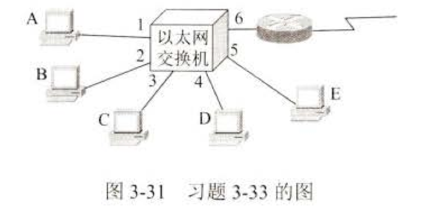

# 作业二: 数据链路层层课后作业

### 1. 写出下列缩略语的英文全称和中文含义

- CRC ：Cyclic Redundancy Check 循环冗余校验
- FEC ：Forward Error Correction 前向纠错
- ARQ ：Automatic Repeat reQuest 自动重传请求
- HDLC ：High-level Data Link Control 高级数据链路控制
- SLIP ：Serial Line Internet Protocol 串行线路互联网协议
- PPP ：Point-to-Point Protocol 点对点协议
- LCP ：Link Control Protocol 链路控制协议
- NCP ：Network Control Protocol 网络控制协议
- CSMA/CD ：Carrier Sense Multiple Access with Collision Detection 载波监听多路访问/冲突检测
- MAC ：Media Access Control 媒体访问控制
- LLC ：Logical Link Control 逻辑链路控制
- NIC ：Network Interface Card 网络接口卡
- VLAN ：Virtual Local Area Network 虚拟局域网
- 10BASE5 ：IEEE 802.3 10Mbps baseband Ethernet over thick coaxial cable 10Mbps基带以太网
- 10BASE2 ：IEEE 802.3 10Mbps baseband Ethernet over thin coaxial cable 10Mbps基带以太网
- 10BASE-T ：IEEE 802.3 10Mbps baseband Ethernet over twisted pair cable 10Mbps基带以太网
- 1BASE5 ：IEEE 802.3 1Mbps baseband Ethernet over thick coaxial cable 1Mbps基带以太网
  
### 2. 若生成多项式为X3+1，信息位多项式X6+X4+1，则CRC冗余多项式是什么？传输帧多项式是什么？

生成多项式为 $$ X^3+1 $$ ，信息位多项式为 $$ X^6+X^4+1 $$

```text
         1011010
    _______________
1001| 1010001000
      1001
    --------------
       0110
       0000
    --------------
        1100
        1001
    --------------
         1011
         1001
    --------------
    			0100
    			0000
    --------------
    			 1000
    			 1001
    --------------
    			  0010
    			  0000
    --------------
    				 010
```

CRC冗余多项式为 $$ X $$

传输帧多项式为 $$ X^9+X^7+X^3+X $$

### 3. 若生成多项式P(X)=X5+X4+X+1，若接收方收到码字为1010110001101问传输中是否有错？

生成多项式 $$ P(X)=X^5+X^4+X+1 $$
接收到的码字为 $$ 1010110001101 $$

```text
             11000100
      _______________
110011| 1010110001101
        110011
       --------------
         110000
         110011
       --------------
          000110
          000000
       --------------
           001100
           000000
       --------------
       			011001
       			000000
       --------------
       			 110011
       			 110011
       --------------
       				000000
       				000000
       --------------
       				 000001
       				 000000
       --------------
                00001
```

余数R=1，传输中有错。

### 4. 设计一个对16比特信息串的单比特纠错海明码需多少冗余校验位？

对于16比特的信息串，设计单比特纠错的海明码需要5个冗余校验位，因为它们需要满足不等式：
$$ 2^r \geq m + r + 1 $$
当$m = 16$时，最小满足条件的$r = 5$。

### 5. 海明码计算题目：设所发送的比特序列为1001011，求其单比特纠错海明码。

假设发送的信息序列长度为 7 位（即 \( m = 7 \)），需要满足不等式：

$$
2^r \geq m + r + 1
$$

尝试 \( r = 4 \) 时：

$$
2^4 = 16 \quad \text{且} \quad m + r + 1 = 7 + 4 + 1 = 12
$$

满足条件，因此需要 **4 个冗余位**。

原始比特序列为 `1001011`，插入校验位后为：

| 位置 | 0001 | 0010 | 0011 | 0100 | 0101 | 0110 | 0111 | 1000 | 1001 | 1010 | 1011 |
| ---- | ---- | ---- | ---- | ---- | ---- | ---- | ---- | ---- | ---- | ---- | ---- |
| 内容 | p1   | p2   | 1    | p4   | 1    | 0    | 1    | p8   | 0    | 0    | 1    |

- **校验位 \( p1 \)：**  
  负责位置 1, 3, 5, 7, 9, 11：
  $$
  p1 = 1 \oplus 1 \oplus 1 \oplus 0 \oplus 1 = 0
  $$
  
- **校验位 \( p2 \)：**  
  负责位置 2, 3, 6, 7, 10, 11：

  $$
  p2 = 1 \oplus 0 \oplus 1 \oplus 0 \oplus 1 = 1
  $$

- **校验位 \( p4 \)：**  
  负责位置 4, 5, 6, 7：
  $$
  p4 = 1 \oplus 0 \oplus 1 = 0
  $$
  
- **校验位 \( p8 \)：**  
  负责位置 8, 9, 10, 11：
  $$
  p8 = 0 \oplus 0 \oplus 1 = 1
  $$

完整的海明码序列为：

$$
10011010110
$$

### 6. 数据率为10Mb/s的以太网在物理媒体上的码元传输速率是多少码元每秒？

以太网使用曼彻斯特编码，每个比特用两个码元表示，因此码元传输速率为 20Mb/s。

### 7. 以太网交换机有何特点？它和集线器有何区别？

每个接口都直接与一个单台主机或另一个以太网交换机相连，并且一般都工作在全双工方式。
◼ 以太网交换机具有并行性。
◼ 能同时连通多对接口，使每一对相互通信的主机都能像独占通信媒体那样，进行无碰撞地传输数据。
◼ 相互通信的主机都是独占传输媒体，无碰撞地传输数据。
◼ 以太网交换机的接口有存储器，能在输出端口繁忙时把到来的帧进行缓存。
◼ 以太网交换机是一种即插即用设备，其内部的帧交换表（又称为地址表）是通过自学习算法自动地逐渐建立起来
◼ 以太网交换机使用了专用的交换结构芯片，用硬件转发，其转发速率要比使用软件转发的网桥快很多。

交换机与集线器的不同
◼ 集线器在转发帧时，不对传输媒体进行检测。
◼ 因为交换机能够有效管理流量并支持全双工通信，其提供的网络带宽和数据吞吐能力比集线器（Hub）要高。

### 8. 一个 PPP 帧的数据部分（用十六进制写出）是 7D 5E FE 27 7D 5D 65 7D 5E。试问真正的数据是什么（用十六进制写出）？

0x7E -> 0x7D 0x5E
0x7D -> 0x7D 0x5D

所以原始数据为：7E FE 27 7D 65 7E

### 9. PPP 协议使用同步传输技术传送比特串 01101111111111100。试问经过零比特填充后变成怎样的比特串？若接收端收到的 PPP 帧的数据部分是 00011111110111110110，试问删除发送端加入的零比特后会变成怎样的比特串？

经过零比特填充后变为：0110111110111110100

删除零比特后变为：0001111111011111110

### 10. 假定 1 km 长的 CSMA/CD 网络的数据率为 1 Gbit/s。设信号在网络上传播速率为 200000 km/s。求能够使用此协议的最短帧长。

传播延迟：

$$
t_{\text{prop}} = \frac{1 \, \text{km}}{200,000 \, \text{km/s}} = 5 \, \mu s
$$

往返延迟：

$$
t_{\text{RTT}} = 2 \times 5 \, \mu s = 10 \, \mu s
$$

最短帧长计算：

$$
L_{\text{min}} = 1 \, \text{Gbit/s} \times 10 \, \mu s = 10,000 \, \text{bit}
$$
即最短帧长为 **10,000 比特**，相当于 **1,250 字节**。

### 11. 假定在使用 CSMA/CD 协议的 10 Mbit/s 以太网中某个站在发送数据时检测到碰撞，执行退避算法时选择了随机数 r = 100。试问这个站需要等待多长时间后才能再次发送数据？如果是 100 Mbit/s 的以太网呢？

#### 1. **10 Mbit/s 以太网的退避时间计算**：

- 数据率为 10 Mbit/s，每比特传输时间为：
  $$
  t_{\text{bit}} = \frac{1}{10 \, \text{Mbit/s}} = 0.1 \, \mu s
  $$

- 1 个时间槽对应的传输时间为：
  $$
  t_{\text{slot}} = 512 \times 0.1 \, \mu s = 51.2 \, \mu s
  $$

- 选择的随机数 \( r = 100 \)，站点需要等待的时间为：
  $$
  t_{\text{wait}} = 100 \times 51.2 \, \mu s = 5.12 \, ms
  $$

#### 2. **100 Mbit/s 以太网的退避时间计算**：

- 数据率为 100 Mbit/s，每比特传输时间为：
  $$
  t_{\text{bit}} = \frac{1}{100 \, \text{Mbit/s}} = 0.01 \, \mu s
  $$

- 1 个时间槽对应的传输时间为：
  $$
  t_{\text{slot}} = 512 \times 0.01 \, \mu s = 5.12 \, \mu s
  $$

- 选择的随机数 \( r = 100 \)，站点需要等待的时间为：
  $$
  t_{\text{wait}} = 100 \times 5.12 \, \mu s = 512 \, \mu s
  $$

### 12. 在图 3-31 中，以太网交换机有 6 个端口，分别接到 5 台主机和一个路由器。下面表中的“动作”一栏中，表示先后发送了 4 个帧。假定在开始时，以太网交换机的交换表是空的。试把该表中其他的栏目都填写完。




| 动作         | 交换表的状态        | 向哪些端口转发帧 | 说明                                                  |
| ------------ | ------------------- | ---------------- | ----------------------------------------------------- |
| A 发送帧给 D | (A,1)               | 2,3,4,5          | 保存A和端口1的对应关系，没有查到D的对应端口，广播该帧 |
| D 发送帧给 A | (A,1)、(D,4)        | 1                | 保存D和端口4的对应关系，查到A对应的端口为1，直接发送  |
| E 发送帧给 A | (A,1)、(D,4)、(E,5) | 1                | 保存E和端口5的对应关系，查到A对应的端口为1，直接发送  |
| A 发送帧给 E | (A,1)、(D,4)、(E,5) | 5                | 查到E对应的端口为5，直接发送                          |


