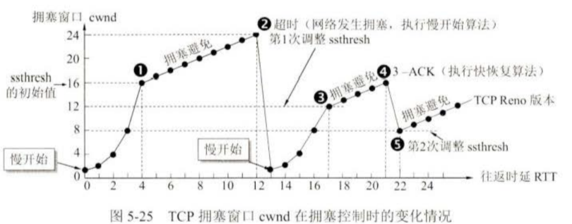
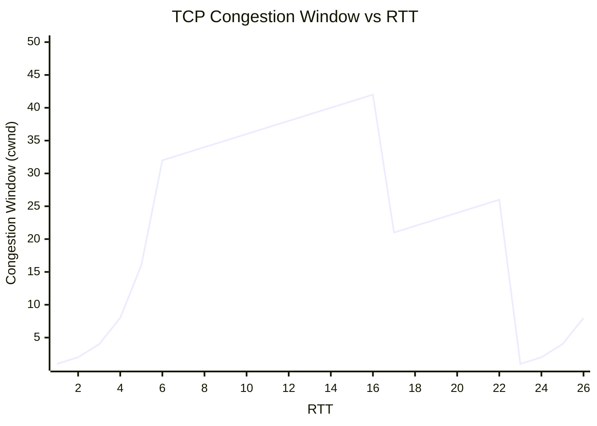
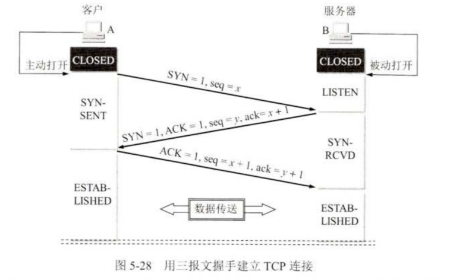
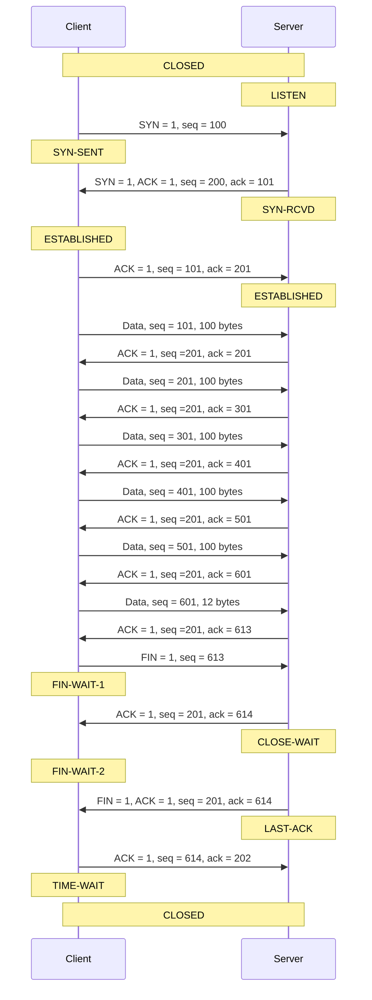

# 作业四: 运输层层课后作业

### 1. 写出下列缩略语的英文全称和中文含义

- TCP: Transmission Control Protocol 传输控制协议
- UDP: User Datagram Protocol 用户数据报协议
- MSS: Maximum Segment Size 最大报文段长度
- ARQ: Automatic Repeat reQuest 自动重传请求
- RTT: Round-Trip Time 往返时间
- RTO: Retransmission TimeOut 重传超时时间

### 2. 写出下列应用程序的熟知端口号

- FTP: 20, 21
- TELNET: 23
- SMTP: 25
- DNS: 53
- TFTP: 69
- HTTP: 80
- SNMP: 161

### 3. 一个 UDP 用户数据报的数据字段为 8192 字节。在链路层要使用以太网来传送。试问应当划分为几个 IP 数据报片？说明每一个 IP 数据报片的数据字段长度和片偏移字段的值。

- UDP 数据字段长度：8192 字节。
- 加上UDP首部长度：8 字节：
  $$ 8192 + 8 = 8200 \, \text{字节} $$
- 每个以太网帧的最大传输单元（MTU）：1500 字节。
- IP 首部长度：20 字节。

每个 IP 数据报片的数据部分的最大长度为：
$$ \text{数据部分长度} = 1500 - 20 = 1480 \, \text{字节} $$

IP 数据报片的数量：
$$ \text{片数量} = \left\lceil \frac{8200}{1480} \right\rceil = 6 $$

### 每个 IP 数据报片的字段值：

| 片序号 | 数据字段长度 (字节) | 片偏移字段值 (字节/8) |
| :----: | :-----------------: | :-------------------: |
|   1    |        1480         |           0           |
|   2    |        1480         |          185          |
|   3    |        1480         |          370          |
|   4    |        1480         |          555          |
|   5    |        1480         |          740          |
|   6    |         800         |          925          |

### 4. 主机 A 向主机 B 连续发送了两个 TCP 报文段，其序号分别是 70 和 100。试问:
(1) 第一个报文段携带了多少字节的数据？
(2) 主机 B 收到第一个报文段后发回的确认中的确认号应当是多少？
(3) 如果 B 收到第二个报文段后发回的确认中的确认号是 180，试问 A 发送的第二个报文段中的数据有多少字节？
(4) 如果 A 发送的第一个报文段丢失了，但第二个报文段到达了 B。B 在第二个报文段到达后向 A 发送确认。试问这个确认号应为多少？

(1) 第一个报文段携带了多少字节的数据？

第一个报文段的序号是 70，第二个报文段的序号是 100。  
因此，第一个报文段携带的数据长度为：
$$ 100 - 70 = 30 \, \text{字节} $$

(2) 主机 B 收到第一个报文段后发回的确认中的确认号应当是多少？

确认号表示期望接收的下一个字节序号。  
因此，主机 B 的确认号为：`$ 100 $`

(3) 如果 B 收到第二个报文段后发回的确认号是 180，试问 A 发送的第二个报文段中的数据有多少字节？

第二个报文段的序号是 100，B 的确认号为 180。  
因此，第二个报文段携带的数据长度为：
$$ 180 - 100 = 80 \, \text{字节} $$

(4) 如果 A 发送的第一个报文段丢失了，但第二个报文段到达了 B。B 在第二个报文段到达后向 A 发送确认。试问这个确认号应为多少？

即使第二个报文段到达了 B，但由于第一个报文段丢失，B 仍会等待第一个报文段的数据。  
因此，B 会重传对第一个报文段的确认，确认号应为：`$ 70 $`

### 5. 设 TCP 使用的最大窗口为 65535 字节，而传输信道不产生差错，带宽也不受限制。若报文段的平均往返时间为 20 ms，问所能得到的最大吞吐量是多少？

给定：
- 最大窗口大小：65535 字节
- 平均往返时间（RTT）：20 ms = 0.02 秒

最大吞吐量为：
$$
\text{最大吞吐量} = \frac{\text{窗口大小}}{\text{往返时间}} = \frac{65535 \, \text{字节}}{0.02 \, \text{秒}} = 3276750 \, \text{字节/秒}
$$

将结果转换为比特：
$$
3276750 \, \text{字节/秒} \times 8 = 26214000 \, \text{比特/秒} = 26.214 \, \text{Mbps}
$$

因此，最大吞吐量为：
$$
26.214 \, \text{Mbps}
$$

### 6. 通信信道带宽为 1 Gbit/s，端到端传播延时为 10 ms。TCP 的发送窗口为 65535 字节。试问: 可能达到的最大吞吐量是多少？信道的利用率是多少？

给定：
- 信道带宽：$$1 \, \text{Gbit/s} = 10^9 \, \text{bit/s}$$
- 端到端传播延时：$$10 \, \text{ms} = 0.01 \, \text{秒}$$
- TCP 发送窗口大小：$$65535 \, \text{字节}$$

**最大吞吐量**：

最大吞吐量为：
$$
\text{最大吞吐量} = \frac{65535 \times 8}{0.02 + \frac{65535 \times 8}{10^9}} = 25.5 \, \text{Mbps}
$$

**信道利用率**：

信道利用率为最大吞吐量与信道带宽的比值：
$$
\text{利用率} = \frac{\text{最大吞吐量}}{\text{信道带宽}} = \frac{25.5 \, \text{Mbps}}{1000 \, \text{Mbps}} = 0.0255 = 2.55\%
$$

### 7. 设 TCP 的 ssthresh 的初始值为 8（单位为报文段）。当拥塞窗口上升到 12 时网络发生了超时，TCP 使用慢开始和拥塞避免。试分别求出 RTT = 1 到 RTT = 15 的各拥塞窗口大小。你能说明拥塞窗口每一次变化的原因吗？

- 初始 `ssthresh = 8` 报文段。
- 拥塞窗口 `cwnd` 开始时为 1，使用慢启动算法。
- 当 `cwnd` 达到 `ssthresh` 后，进入拥塞避免阶段。
- 当 `cwnd = 12` 时发生超时，`ssthresh` 设为当前 `cwnd` 的一半，并且 `cwnd` 重置为 1。

#### 拥塞窗口变化情况：

|  RTT  | 拥塞窗口大小 (cwnd) |               变化原因                |
| :---: | :-----------------: | :-----------------------------------: |
|   1   |          1          |        慢启动，初始 `cwnd` = 1        |
|   2   |          2          |     慢启动，指数增长 (`cwnd` × 2)     |
|   3   |          4          |     慢启动，指数增长 (`cwnd` × 2)     |
|   4   |          8          |      慢启动，达到 `ssthresh` = 8      |
|   5   |          9          |    拥塞避免，线性增长 (`cwnd + 1`)    |
|   6   |         10          |    拥塞避免，线性增长 (`cwnd + 1`)    |
|   7   |         11          |    拥塞避免，线性增长 (`cwnd + 1`)    |
|   8   |         12          |    拥塞避免，线性增长 (`cwnd + 1`)    |
|   9   |          1          | 超时，`ssthresh` = 6，`cwnd` 重置为 1 |
|  10   |          2          |     慢启动，指数增长 (`cwnd` × 2)     |
|  11   |          4          |     慢启动，指数增长 (`cwnd` × 2)     |
|  12   |          6          |      慢启动，达到 `ssthresh` = 6      |
|  13   |          7          |    拥塞避免，线性增长 (`cwnd + 1`)    |
|  14   |          8          |    拥塞避免，线性增长 (`cwnd + 1`)    |
|  15   |          9          |    拥塞避免，线性增长 (`cwnd + 1`)    |

### 8. TCP 的拥塞窗口 `cwnd` 大小与 `RTT` 的关系如下所示：

| cwnd | 1   | 2   | 4   | 8   | 16  | 32  | 33  | 34  | 35  | 36  | 37  | 38  | 39  |
| ---- | --- | --- | --- | --- | --- | --- | --- | --- | --- | --- | --- | --- | --- |
| RTT  | 1   | 2   | 3   | 4   | 5   | 6   | 7   | 8   | 9   | 10  | 11  | 12  | 13  |

| cwnd | 40  | 41  | 42  | 21  | 22  | 23  | 24  | 25  | 26  | 1   | 2   | 4   | 8   |
| ---- | --- | --- | --- | --- | --- | --- | --- | --- | --- | --- | --- | --- | --- |
| RTT  | 14  | 15  | 16  | 17  | 18  | 19  | 20  | 21  | 22  | 23  | 24  | 25  | 26  |

1. 试画出如图 5-25 所示的拥塞窗口与 `RTT` 的关系曲线。
2. 指明 TCP 工作在慢开始阶段时的时间间隔。
3. 指明 TCP 工作在拥塞避免阶段的时间间隔。
4. 在 `RTT = 16` 和 `RTT = 22` 之后发送方是通过收到三个重复的确认还是通过超时检测到丢失了报文段？
5. 在 `RTT = 1`, `RTT = 18` 和 `RTT = 24` 时，门限 `ssthresh` 分别被设置为多大？
6. 在 `RTT` 等于多少时发送出第 70 个报文段？
7. 假定在`RTT = 26`之后收到了三个重复的确认，因而检测出了报文段的丢失，那么拥塞窗口`cwnd`和门限`ssthresh`应设置为多大？

(1) 试画出如图 5-25 所示的拥塞窗口与 `RTT` 的关系曲线。

(2) 慢开始阶段的时间间隔：

慢开始阶段：拥塞窗口 `cwnd` 按指数增长。

**慢开始阶段：**
$$ RTT = 1 \, \text{到} \, RTT = 6 $$
- 拥塞窗口从 1 增长到 32。

(3) 拥塞避免阶段的时间间隔：

拥塞避免阶段：拥塞窗口 `cwnd` 按线性增长。

**拥塞避免阶段：**
$$ RTT = 7 \, \text{到} \, RTT = 16 $$

(4) 在 `RTT = 16` 和 `RTT = 22` 之后如何检测丢失了报文段？

- **RTT = 16**：`cwnd` 从 42 突然降到 21，说明是通过收到 **三个重复确认** 检测到丢失报文段，触发快速重传。
- **RTT = 22**：`cwnd` 从 26 突然降到 1，说明是通过 **超时** 检测到丢失报文段，触发超时重传。

(5) 在 `RTT = 1`, `RTT = 18` 和 `RTT = 24` 时，门限 `ssthresh` 分别被设置为多大？

- **RTT = 1**：初始状态，`ssthresh` 为 32。
- **RTT = 18**：经过一次快速重传，`sshtresh` 被设置为：
  $$ \text{ssthresh} = \lfloor \frac{42}{2} \rfloor = 21 $$
- **RTT = 24**：又经过一次超时重传，`ssthresh` 被设置为：
  $$ \text{ssthresh} = \lfloor \frac{21}{2} \rfloor = 10 $$

(6) 在 `RTT` 等于多少时发送出第 70 个报文段？

为了估算，我们可以计算到第 70 个报文段发送时 `cwnd` 的累积值：
$$
\text{累积数据量} = \sum_{n=1}^{k} \text{cwnd}_{RTT=n}
$$

- RTT = 1 到 RTT = 6 的总数据量：$$ 1 + 2 + 4 + 8 + 16 + 32 = 63 \, \text{报文段} $$
- RTT = 1 到 RTT = 7 的总数据量：$$ 1 + 2 + 4 + 8 + 16 + 32 + 33 = 96 \, \text{报文段} $$

因此，在 **RTT = 7** 时，发送出第 70 个报文段。

(7) 在 `RTT = 26` 后检测到丢失，`cwnd` 和 `ssthresh` 的设置：

假设在 `RTT = 26` 后收到了三个重复确认，丢失了报文段：

此时 `cwnd` 为 8，`ssthresh` 将被设置为当前 `cwnd` 的一半，新的 `cwnd` 和 `ssthresh` 一样：
  $$ \text{cwnd} = \text{ssthresh} = \frac{8}{2} = 4 $$

### 9. 用 TCP 传送 512 字节的数据。设窗口为 100 字节，而 TCP 报文段每次也是传送 100 字节的数据。再次发送与和接收的报文段序号分别选为 100 和 200，试画出类似于图 5-28 的工作示意图。从连接建立到段释放都要画上（可不考虑发送延迟）。

